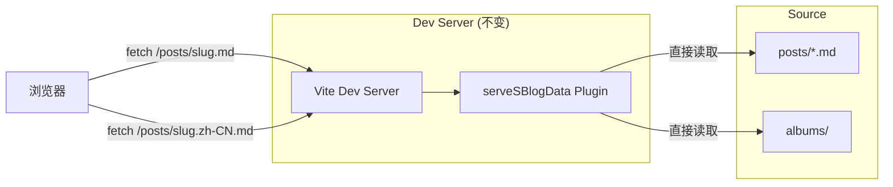
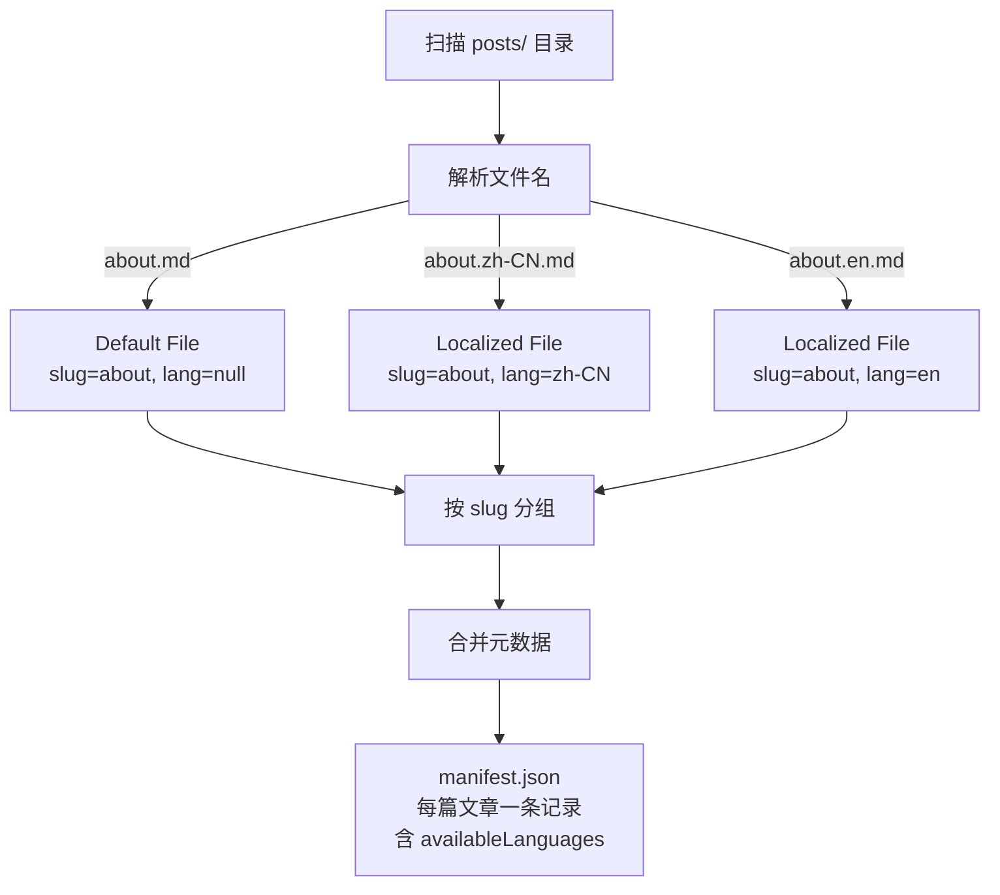

# Design Document: Content Source Management & i18n

## Overview

本设计文档描述了 s-blog 博客系统的两项核心改进：

1. **消除源文件副本**：重构构建流程，使 Markdown 源文件和生成的数据不再经过 `public/` 中间目录，而是在生产构建时直接写入 `dist/`。开发环境下，Vite 插件继续直接从源目录提供文件服务。
2. **多语言 Markdown 支持**：通过文件命名规范（`{slug}.{lang}.md`）支持同一篇文章的多语言版本，Rust 引擎在 manifest 中记录可用语言信息，前端根据用户当前语言自动选择对应版本。

### 设计原则

- **最小侵入**：尽量复用现有 Rust 引擎和 NAPI 绑定架构，在现有 `generate_posts_data` 基础上扩展
- **向后兼容**：不使用多语言功能的项目，构建行为与之前完全一致
- **单一数据源**：`posts/` 目录是唯一的内容源，`public/` 不再包含任何构建生成的内容

### 当前架构 vs 目标架构

```
当前构建流程:
  posts/*.md ──→ Rust Engine ──→ public/generated/manifest.json
                                  public/posts/*.md (副本)
                 copy-public.ts ──→ dist/generated/manifest.json
                                    dist/posts/*.md

目标构建流程:
  posts/*.md ──→ Rust Engine ──→ dist/generated/manifest.json
                                  dist/posts/*.md (直接输出)
  (public/ 中不再有 posts/、generated/、albums/ 子目录)
```

---

## Architecture

### 构建流程改造

```mermaid
graph TB
    subgraph "Source (不变)"
        POSTS[posts/*.md<br/>posts/*.{lang}.md]
        ALBUMS[albums/]
        CONFIG[config.json]
    end

    subgraph "Rust Engine (改造)"
        ENGINE[s-blog-engine]
        ENGINE --> |generate_posts_data| MANIFEST[manifest.json]
        ENGINE --> |generate_albums_data| ALBUM_DATA[albums-index.json]
        ENGINE --> |i18n 解析| I18N_META[availableLanguages]
    end

    subgraph "Build Script (改造)"
        BUILD[build-rust.cjs]
        BUILD --> |output_dir=dist| DIST_OUT[dist/]
    end

    subgraph "dist/ (最终输出)"
        DIST_MANIFEST[dist/generated/manifest.json]
        DIST_POSTS[dist/posts/*.md]
        DIST_ALBUMS[dist/albums/]
        DIST_SHELL[dist/index.html + assets/]
    end

    POSTS --> ENGINE
    CONFIG --> ENGINE
    ENGINE --> BUILD
    BUILD --> DIST_MANIFEST
    BUILD --> DIST_POSTS
    ALBUMS --> BUILD
    BUILD --> DIST_ALBUMS
```

### 开发环境流程



开发环境下，`serveSBlogData` 插件已经直接从项目根目录的 `posts/` 和 `albums/` 提供文件，无需任何改动。前端请求 `/posts/{slug}.{lang}.md` 时，插件会自动映射到 `posts/{slug}.{lang}.md` 源文件。

### 多语言文件解析流程



---

## Components and Interfaces

### 1. Rust Engine 扩展：多语言文件名解析

在 `crates/s-blog-engine/src/posts.rs` 中新增文件名解析逻辑。

```rust
/// 解析 Markdown 文件名，提取 slug 和可选的语言代码。
///
/// 命名规范: `{slug}.md` (默认) 或 `{slug}.{lang}.md` (本地化)
/// 语言代码遵循 BCP 47 格式，如 `zh-CN`、`en`、`ja`。
///
/// 返回 (slug, Option<language_code>)
pub fn parse_post_filename(filename: &str) -> (String, Option<String>) {
    // 去掉 .md 后缀
    let stem = filename.strip_suffix(".md").unwrap_or(filename);
    
    // 尝试匹配 BCP 47 语言代码模式: {slug}.{lang}
    // BCP 47 示例: en, zh-CN, ja, pt-BR
    // 策略: 从最后一个 '.' 分割，检查后半部分是否为有效的 BCP 47 语言标签
    if let Some(dot_pos) = stem.rfind('.') {
        let potential_lang = &stem[dot_pos + 1..];
        if is_bcp47_language_tag(potential_lang) {
            let slug = stem[..dot_pos].to_string();
            return (slug, Some(potential_lang.to_string()));
        }
    }
    
    (stem.to_string(), None)
}

/// 简单的 BCP 47 语言标签验证。
/// 支持: "en", "zh", "ja", "zh-CN", "pt-BR", "en-US" 等。
fn is_bcp47_language_tag(s: &str) -> bool {
    // 2-3 字母的主语言标签，可选 '-' + 2-8 字母/数字的子标签
    let parts: Vec<&str> = s.split('-').collect();
    if parts.is_empty() || parts.len() > 3 {
        return false;
    }
    // 主标签: 2-3 个 ASCII 字母
    let primary = parts[0];
    if primary.len() < 2 || primary.len() > 3 || !primary.chars().all(|c| c.is_ascii_alphabetic()) {
        return false;
    }
    // 子标签: 2-8 个 ASCII 字母或数字
    for subtag in &parts[1..] {
        if subtag.len() < 2 || subtag.len() > 8 
            || !subtag.chars().all(|c| c.is_ascii_alphanumeric()) {
            return false;
        }
    }
    true
}
```

### 2. Rust Engine 扩展：PostMetadata 增加 i18n 字段

```rust
// crates/s-blog-engine/src/lib.rs

/// Localized metadata for a single language version of a post.
#[derive(Debug, Clone, Serialize, Deserialize)]
pub struct LocalizedPostMeta {
    pub title: String,
    pub summary: String,
}

/// Metadata for a single blog post (written to `manifest.json`).
#[derive(Debug, Clone, Serialize, Deserialize)]
#[serde(rename_all = "camelCase")]
pub struct PostMetadata {
    pub slug: String,
    pub title: String,
    pub date: String,
    pub tags: Vec<String>,
    pub categories: Vec<String>,
    pub summary: String,
    /// 可用的本地化语言列表 (不含默认语言)。
    /// 空数组表示该文章仅有默认版本。
    #[serde(default)]
    pub available_languages: Vec<String>,
    /// 各语言版本的 title 和 summary。
    /// 键为语言代码，值为该语言的本地化元数据。
    /// 键集合与 available_languages 一致。
    #[serde(default, skip_serializing_if = "HashMap::is_empty")]
    pub localized_meta: HashMap<String, LocalizedPostMeta>,
}
```

### 3. Rust Engine 改造：`generate_posts_data` 支持直接输出和 i18n

改造 `generate_posts_data` 函数，使其：
- 解析多语言文件名，按 slug 分组
- 为每篇文章生成包含 `availableLanguages` 的元数据
- 将 manifest 和 Markdown 文件直接写入 `output_dir`（不再假设 `output_dir` 是 `public/`）
- 跳过仅有本地化文件而无默认文件的 slug

```rust
/// 生成文章清单并复制 Markdown 文件到输出目录。
///
/// 改造要点:
/// 1. 解析多语言文件名 ({slug}.{lang}.md)
/// 2. 按 slug 分组，合并同一文章的多语言版本
/// 3. manifest 中每篇文章记录 availableLanguages
/// 4. 所有文件直接写入 output_dir (可以是 dist/)
/// 5. 若某 slug 仅有本地化文件而无默认文件，输出警告并跳过
pub fn generate_posts_data(
    posts_dir: &Path,
    output_dir: &Path,
    config: &SiteConfig,
) -> Result<Vec<PostMetadata>, EngineError>;
```

**分组逻辑**：
1. 扫描 `posts/` 目录中所有 `.md` 文件
2. 对每个文件调用 `parse_post_filename` 提取 `(slug, lang)`
3. 按 slug 分组：`HashMap<String, PostGroup>`
4. 每个 `PostGroup` 包含默认文件（`lang=None`）和本地化文件列表
5. 使用默认文件的 frontmatter 作为 manifest 中的主元数据
6. `availableLanguages` = 所有本地化文件的语言代码列表
7. `localizedMeta` = 各本地化文件的 title 和 summary 映射（从各自的 frontmatter 中提取，title 缺失时回退到默认文件的 title）
8. **如果某 slug 仅有本地化文件而无默认文件，输出 `warn!` 日志并跳过该 slug 的所有文件（不纳入 manifest，不复制到输出目录）**

### 4. NAPI 绑定更新

`crates/s-blog-engine-napi/src/lib.rs` 中的 `generate_posts_data` 函数签名不变，因为它已经接受 `output_dir` 参数。只需确保返回的 JSON 包含新增的 `availableLanguages` 字段。

### 5. Build Script 改造

`build-rust.cjs` 的关键改动：

```javascript
// 之前: 输出到 public/，再由 copy-public.ts 复制到 dist/
const postsResult = engine.generatePostsData('posts', 'public', configRaw);

// 之后: 直接输出到 dist/
const postsResult = engine.generatePostsData('posts', 'dist', configRaw);
const albumsResult = engine.generateAlbumsData('albums', 'dist', albumConfigRaw, configRaw);

// 不再需要从 public/ 复制 generated/ 和 posts/ 到 dist/
// copy-public.ts 仅复制真正的静态资源 (favicon, logo, _redirects 等)
```

### 6. Frontend 扩展：PostMetadata 类型更新

```typescript
// packages/core/src/types/blog.ts

export interface LocalizedPostMeta {
  title: string;
  summary: string;
}

export interface PostMetadata {
  slug: string;
  title: string;
  date: string;
  tags: string[];
  categories: string[];
  summary: string;
  availableLanguages: string[];                        // 新增
  localizedMeta?: Record<string, LocalizedPostMeta>;   // 新增
}
```

### 7. Frontend 扩展：语言感知文章加载 Hook

```typescript
// packages/core/src/hooks/usePost.ts (改造)
export function usePost(slug: string | undefined) {
  const { i18n } = useTranslation();
  const currentLang = i18n.resolvedLanguage;
  
  // 加载逻辑:
  // 1. 检查 post.availableLanguages 是否包含 currentLang
  // 2. 如果包含，fetch `/posts/${slug}.${currentLang}.md`
  // 3. 如果不包含，fetch `/posts/${slug}.md` (默认文件)
  // 4. 默认文件始终存在（Rust 引擎保证：无默认文件的 slug 不会出现在 manifest 中）
  // 5. 当 currentLang 变化时，重新加载
}
```

### 8. Frontend 扩展：语言感知文章列表 Hook

```typescript
// packages/core/src/hooks/usePosts.ts (改造)
export function usePosts() {
  const { i18n } = useTranslation();
  const currentLang = i18n.resolvedLanguage;

  // manifest.json 中每篇文章已经只有一条记录 (按 slug 去重)
  // 前端根据 currentLang 从 localizedMeta 中取对应语言的 title/summary
  // 如果 localizedMeta[currentLang] 存在，使用其 title 和 summary
  // 否则回退到顶层的 title 和 summary（默认文件的元数据）
  //
  // 文章列表天然不会重复，因为 Rust 引擎已按 slug 去重
}
```

### 9. Frontend 扩展：文章级语言切换

```typescript
// packages/core/src/components/PostLanguageSwitcher.tsx (新增)
interface PostLanguageSwitcherProps {
  availableLanguages: string[];
  currentLanguage: string;
  onLanguageChange: (lang: string) => void;
}

// 仅当 availableLanguages.length > 0 时渲染
// 显示可用语言按钮，高亮当前语言
```

---

## Data Models

### 多语言 Manifest 结构

```json
// dist/generated/manifest.json
[
  {
    "slug": "hello-world",
    "title": "Hello World",
    "date": "2025-01-15T10:30:00",
    "tags": ["intro"],
    "categories": ["General"],
    "summary": "My first post...",
    "availableLanguages": ["ja", "zh-CN"],
    "localizedMeta": {
      "zh-CN": { "title": "你好世界", "summary": "我的第一篇文章..." },
      "ja": { "title": "ハローワールド", "summary": "最初の投稿..." }
    }
  },
  {
    "slug": "about",
    "title": "About",
    "date": "2025-01-10T00:00:00",
    "tags": [],
    "categories": [],
    "summary": "About this blog...",
    "availableLanguages": []
  }
]
```

**字段语义**：
- `availableLanguages: ["ja", "zh-CN"]` — 存在 `hello-world.zh-CN.md` 和 `hello-world.ja.md`
- `localizedMeta` — 各语言版本的 title 和 summary，键集合与 `availableLanguages` 一致；无本地化版本时省略该字段
- `availableLanguages: []` — 仅有 `about.md`，无本地化版本，无 `localizedMeta` 字段

### 文件目录结构示例

```
posts/
├── hello-world.md          # 默认版本
├── hello-world.zh-CN.md    # 中文版本
├── hello-world.ja.md       # 日文版本
├── about.md                # 仅默认版本
└── Album-Module.md         # 仅默认版本

dist/ (生产构建输出)
├── generated/
│   └── manifest.json       # 包含 i18n 字段
├── posts/
│   ├── hello-world.md
│   ├── hello-world.zh-CN.md
│   ├── hello-world.ja.md
│   ├── about.md
│   └── Album-Module.md
├── albums/
│   └── ...
├── index.html
└── assets/
    └── ...

public/ (改造后仅保留)
├── favicon.ico
├── logo.png
└── _redirects
```

### Rust 内部数据结构

```rust
/// 文章分组：同一 slug 的所有语言版本
struct PostGroup {
    slug: String,
    /// 默认文件 (无语言后缀) 的内容和元数据
    default_file: Option<PostFileInfo>,
    /// 本地化文件列表: (language_code, PostFileInfo)
    localized_files: Vec<(String, PostFileInfo)>,
}

struct PostFileInfo {
    filename: String,
    frontmatter: FrontmatterData,
    body: String,
}
```

---

## Correctness Properties

*A property is a characteristic or behavior that should hold true across all valid executions of a system—essentially, a formal statement about what the system should do. Properties serve as the bridge between human-readable specifications and machine-verifiable correctness guarantees.*

本功能的核心逻辑适合属性测试：
- 文件名解析/生成是纯函数，具有明确的往返属性
- Manifest 生成是确定性的数据转换，输入空间大（任意文件集合）
- 前端 URL 解析是纯函数，输入组合多样

### Property 1: Filename parsing round-trip

*For any* valid slug (non-empty, no dots, no language-code-like suffix) and any valid BCP 47 language code, constructing the filename `{slug}.{lang}.md` and then parsing it with `parse_post_filename` SHALL return the original `(slug, Some(lang))`. Similarly, for any valid slug without a language code, constructing `{slug}.md` and parsing it SHALL return `(slug, None)`.

**Validates: Requirements 2.1, 2.3, 3.4**

### Property 2: Manifest i18n completeness and slug uniqueness

*For any* set of valid Markdown files in the posts directory (including a mix of default files and localized files), the generated manifest SHALL contain exactly one entry per unique slug that has a default file, and each entry's `availableLanguages` array SHALL contain exactly the set of language codes for which localized files exist for that slug. When a slug has only a default file and no localized files, `availableLanguages` SHALL be an empty array. When a slug has only localized files but no default file, it SHALL NOT appear in the manifest.

**Validates: Requirements 2.2, 2.4, 3.1, 3.2, 3.3, 5.3, 6.1**

### Property 3: Frontend article URL resolution

*For any* post metadata with a given slug and `availableLanguages` list, and any current language setting: if the current language is present in `availableLanguages`, the resolved fetch URL SHALL be `/posts/{slug}.{currentLang}.md`; otherwise, the resolved fetch URL SHALL be `/posts/{slug}.md`.

**Validates: Requirements 4.1, 4.2**

### Property 4: Manifest localizedMeta completeness

*For any* set of valid Markdown files in the posts directory, the generated manifest's `localizedMeta` keys SHALL exactly match the `availableLanguages` array for each entry. Each `localizedMeta` entry SHALL contain a non-empty `title` (falling back to the default file's title if the localized frontmatter lacks one) and a `summary` string. When `availableLanguages` is empty, `localizedMeta` SHALL be empty or absent.

**Validates: Requirements 3.5, 3.6, 3.7, 3.8, 5.1, 5.2**

---

## Error Handling

| 场景 | 错误类型 | 处理方式 |
|------|----------|----------|
| posts/ 目录不存在 | `EngineError::DirectoryNotFound` | 返回错误，构建终止 |
| Markdown 文件 frontmatter 解析失败 | `EngineError::FrontmatterParse` | 警告并跳过该文件 |
| 文件名无法解析（非 .md 文件） | — | 静默跳过 |
| 同一 slug 存在 `about.md` 和 `about.en.md` 且内容不一致 | 命名冲突警告 | 输出 `warn!` 日志，继续构建。`about.md` 作为默认版本，`about.en.md` 作为英文本地化版本 |
| 本地化文件存在但默认文件不存在 | — | 输出 `warn!` 日志并跳过该 slug 的所有本地化文件（不纳入 manifest，不复制到输出目录） |
| 前端 fetch 本地化文件返回 404 | FetchError | 回退加载默认文件 `/posts/{slug}.md` |
| 前端 fetch 默认文件也返回 404 | FetchError | 显示"文章未找到"错误信息 |
| 无效的 BCP 47 语言代码在文件名中 | — | 将整个 stem 作为 slug（如 `about.123.md` → slug=`about.123`, lang=None） |

### 错误消息格式

```rust
// 新增的警告消息
warn!("Naming conflict for slug '{}': both default file and .{}.md exist", slug, lang);
warn!("No default file for slug '{}', localized files will be skipped", slug);
```

---

## Testing Strategy

### 测试方法概述

本项目采用双重测试策略：
1. **属性测试 (Property-Based Testing)**：验证文件名解析、manifest 生成、URL 解析的通用正确性
2. **单元测试 (Example-Based)**：验证具体场景、边界情况和错误处理
3. **集成测试**：验证构建流程端到端正确性

### 属性测试配置

- **Rust**: 使用 `proptest` 库，每个属性测试最少 100 次迭代
- **TypeScript**: 使用 `fast-check` 库，每个属性测试最少 100 次迭代
- 每个属性测试必须通过注释引用设计文档中的属性编号

### Rust 属性测试

```rust
// crates/s-blog-engine/tests/i18n_props.rs
use proptest::prelude::*;

proptest! {
    #![proptest_config(ProptestConfig::with_cases(100))]

    // Feature: content-source-management-and-i18n, Property 1: Filename parsing round-trip
    #[test]
    fn filename_roundtrip_with_lang(
        slug in "[a-zA-Z][a-zA-Z0-9_-]{0,30}",
        lang in "(en|zh|ja|zh-CN|pt-BR|en-US|ko|fr|de|es)"
    ) {
        let filename = format!("{slug}.{lang}.md");
        let (parsed_slug, parsed_lang) = parse_post_filename(&filename);
        prop_assert_eq!(parsed_slug, slug);
        prop_assert_eq!(parsed_lang, Some(lang.to_string()));
    }

    // Feature: content-source-management-and-i18n, Property 1: Filename parsing round-trip (default)
    #[test]
    fn filename_roundtrip_default(
        slug in "[a-zA-Z][a-zA-Z0-9_-]{0,30}"
    ) {
        let filename = format!("{slug}.md");
        let (parsed_slug, parsed_lang) = parse_post_filename(&filename);
        prop_assert_eq!(parsed_slug, slug);
        prop_assert!(parsed_lang.is_none());
    }

    // Feature: content-source-management-and-i18n, Property 2: Manifest i18n completeness
    #[test]
    fn manifest_slug_uniqueness_and_languages(
        // Generate random post file configurations
        post_configs in prop::collection::vec(
            (
                "[a-z][a-z0-9-]{0,10}",                    // slug
                prop::bool::ANY,                             // has default file
                prop::collection::vec("(zh-CN|en|ja)", 0..3) // localized languages
            ),
            1..5
        )
    ) {
        // Build file set, run generate_posts_data, verify manifest
        // Each unique slug WITH a default file should appear exactly once
        // Slugs WITHOUT a default file should NOT appear in manifest
        // availableLanguages should match localized files
    }
}
```

### TypeScript 属性测试

```typescript
// packages/core/src/hooks/__tests__/usePost.prop.test.ts
import fc from 'fast-check';

// Feature: content-source-management-and-i18n, Property 3: Frontend article URL resolution
test('resolvePostUrl returns correct URL based on language availability', () => {
  fc.assert(
    fc.property(
      fc.string({ minLength: 1, maxLength: 20 }).filter(s => /^[a-z][a-z0-9-]*$/.test(s)),  // slug
      fc.array(fc.constantFrom('zh-CN', 'en', 'ja', 'ko', 'fr'), { minLength: 0, maxLength: 5 }), // availableLanguages
      fc.constantFrom('zh-CN', 'en', 'ja', 'ko', 'fr', 'de'),  // currentLang
      (slug, availableLanguages, currentLang) => {
        const url = resolvePostUrl(slug, availableLanguages, currentLang);
        if (availableLanguages.includes(currentLang)) {
          expect(url).toBe(`/posts/${slug}.${currentLang}.md`);
        } else {
          expect(url).toBe(`/posts/${slug}.md`);
        }
      }
    ),
    { numRuns: 100 }
  );
});
```

### 单元测试

#### Rust 单元测试

```rust
// crates/s-blog-engine/src/posts.rs (mod tests)

#[test]
fn parse_filename_default() {
    assert_eq!(parse_post_filename("about.md"), ("about".into(), None));
}

#[test]
fn parse_filename_with_lang() {
    assert_eq!(parse_post_filename("about.zh-CN.md"), ("about".into(), Some("zh-CN".into())));
}

#[test]
fn parse_filename_numeric_suffix_not_lang() {
    // "about.123.md" — 123 is not a valid BCP 47 tag
    assert_eq!(parse_post_filename("about.123.md"), ("about.123".into(), None));
}

#[test]
fn parse_filename_slug_with_dots() {
    // "my.post.en.md" — "en" is a valid lang, slug is "my.post"
    assert_eq!(parse_post_filename("my.post.en.md"), ("my.post".into(), Some("en".into())));
}

#[test]
fn manifest_no_localized_files() {
    // Only about.md → availableLanguages=[]
}

#[test]
fn manifest_with_localized_files() {
    // about.md + about.zh-CN.md + about.ja.md
    // → availableLanguages=["ja", "zh-CN"]
}

#[test]
fn manifest_only_localized_no_default() {
    // about.zh-CN.md only, no about.md
    // → warn! logged, slug skipped, not in manifest
}

#[test]
fn naming_conflict_warning() {
    // about.md and about.en.md both exist — should log warning
}
```

#### TypeScript 单元测试

```typescript
// packages/core/src/hooks/__tests__/usePost.test.ts

test('loads localized file when available', async () => {
  // Mock: post has availableLanguages: ['zh-CN'], currentLang: 'zh-CN'
  // Expect: fetch('/posts/about.zh-CN.md')
});

test('falls back to default file when localized not available', async () => {
  // Mock: post has availableLanguages: ['zh-CN'], currentLang: 'en'
  // Expect: fetch('/posts/about.md')
});

test('shows error when both localized and default files missing', async () => {
  // Mock: fetch returns 404 for both URLs
  // Expect: error state
});

test('reloads when language changes', async () => {
  // Change i18n language, verify new fetch is triggered
});

test('PostLanguageSwitcher hidden when no localized versions', () => {
  // availableLanguages: [] → component not rendered
});

test('PostLanguageSwitcher shown when localized versions exist', () => {
  // availableLanguages: ['zh-CN', 'ja'] → component rendered with buttons
});
```

### 集成测试

```bash
# 构建流程集成测试
# 1. 准备测试 posts/ 目录 (含多语言文件)
# 2. 运行 build-rust.cjs
# 3. 验证 dist/ 结构正确
# 4. 验证 public/ 不含 posts/、generated/、albums/
# 5. 验证 manifest.json 包含正确的 i18n 字段
```

### 测试命令

```bash
# Rust 测试 (含属性测试)
cargo test                              # 所有测试
cargo test --test i18n_props            # 仅 i18n 属性测试

# TypeScript 测试
npx vitest run                          # 所有测试
npx vitest run usePost.prop.test        # 仅 URL 解析属性测试

# 集成测试
node build-rust.cjs && node test-build-output.js
```

