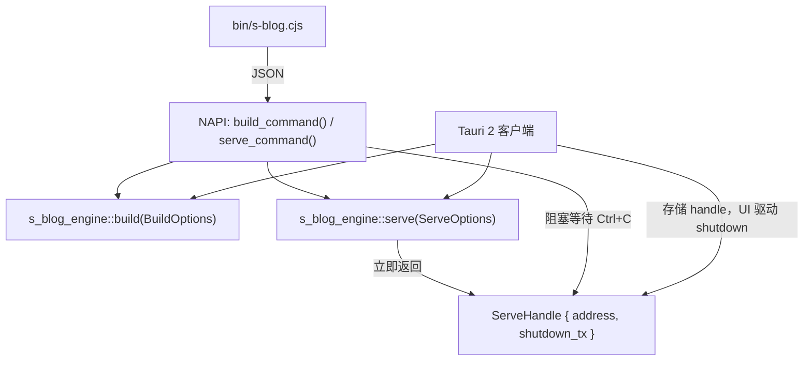

# 设计文档：engine-cli-commands

## 概述

为 `@s-blog/engine` 新增 `build` 和 `serve` 两个 CLI 命令，替代临时的 `build-rust.cjs`。

**三层架构：**

| 层 | 位置 | 职责 |
|----|------|------|
| Rust Crate | `s-blog-engine` | 所有构建/服务逻辑（`build()` / `serve()`） |
| NAPI | `s-blog-engine-napi` | JSON ↔ Rust 结构体转换 |
| CLI | `bin/s-blog.cjs` | 解析 `process.argv`，调用 NAPI，格式化输出 |

**核心设计决策：**
- CLI 使用 CommonJS（兼容 NAPI `require()`），无第三方框架，<200 行
- 所有文件 I/O 在 Rust 层完成，CLI 零 `fs` 调用
- Tauri 客户端可直接调用 `s_blog_engine::build()` / `serve()`
- 工作区保持干净：开发中间产物放 `.cache/`，生产产物放 `dist/`
- 默认零配置即可使用，高级用户可通过选项自定义

**两个命令的定位：**

| | `s-blog build` | `s-blog serve` |
|---|---|---|
| 用途 | 生产打包，输出可部署的最终产物 | 开发预览，实时查看文章效果 |
| 输出 | `dist/`（完整静态站点） | `.cache/`（中间数据）+ HTTP 服务器 |
| 包含 | 全部步骤（shell + 文章 + 相册 + SEO + 静态资源） | 仅数据生成（manifest + 相册）+ 本地服务器 |
| 典型用法 | `s-blog build` → 部署 dist/ | `s-blog serve` → 浏览器打开预览 |

## 架构



**`s-blog build` 流程（生产）：**
1. 清理 `dist/`
2. 复制 app shell（修正 basePath）
3. 生成文章数据（manifest + Markdown 复制）
4. 生成相册数据（索引 + 缩略图）
5. 生成 SEO 页面 + sitemap + rss + robots
6. 复制静态资源（albums 原图、public/ 文件、配置文件）

**`s-blog serve` 流程（开发）：**
1. 生成 manifest 到 `.cache/manifest.json`
2. 生成相册数据到 `.cache/`（索引 + 详情）
3. 启动 HTTP 服务器，服务以下内容：
   - App shell（`@s-blog/core/dist/shell/` 的 HTML/CSS/JS）
   - `.cache/` 中的生成数据
   - `posts/` 源文件（Markdown）
   - `albums/` 源文件（原始图片）
   - `public/` 静态资源（favicon 等）
   - SPA 回退（未匹配路径返回 index.html）

> **热更新策略：** 服务器不缓存文件内容，每次请求都从磁盘读取最新文件。用户修改 Markdown 后刷新浏览器即可看到更新，无需重启。唯一需要重启 `serve` 的情况是新增/删除文章（因为 manifest 在启动时生成）。
>
> **未来增强（本次不实现）：** 文件监听——检测 `posts/` 新增/删除时自动重新生成 manifest，实现完全免重启。

## 组件与接口

### CLI（`bin/s-blog.cjs`）

最简使用（非技术用户只需知道这两条）：

```bash
s-blog build     # 生产构建
s-blog serve     # 开发预览
```

高级选项：

```bash
s-blog build --output <目录>    # 自定义输出目录（默认 dist/）
s-blog serve --port <端口>      # 自定义端口（默认 3000）
s-blog --version                # 显示版本号
```

### NAPI 新增函数

```rust
/// 执行生产构建，返回 BuildResult JSON
#[napi]
pub fn build_command(options_json: String) -> napi::Result<String>

/// 启动开发预览服务器（生成数据 + HTTP 服务）。
/// 内部调用 Rust 层 serve() 获取 ServeHandle，然后阻塞等待 Ctrl+C 信号。
/// CLI 场景专用——Tauri 客户端应直接调用 Rust 层 serve() 获取 handle 自行管理生命周期。
#[napi]
pub fn serve_command(options_json: String) -> napi::Result<()>
// 实现伪代码：
// let handle = s_blog_engine::serve(opts)?;
// println!("http://{}/", handle.address());
// wait_for_ctrl_c();       // 阻塞
// handle.shutdown();       // 优雅关闭
```

### Rust Crate 公开 API

```rust
// crates/s-blog-engine/src/build.rs
pub fn build(opts: BuildOptions) -> Result<BuildResult, EngineError>

// crates/s-blog-engine/src/serve.rs
/// 启动开发预览服务器。
/// **非阻塞**：内部 spawn tokio task 运行 HTTP 服务器，立即返回 ServeHandle。
/// 调用方通过 handle 查询绑定地址、控制服务器生命周期。
pub fn serve(opts: ServeOptions) -> Result<ServeHandle, EngineError>
```

**调用方使用模式：**

| 调用方 | 模式 |
|--------|------|
| CLI（NAPI `serve_command`） | 调用 `serve()` → 获取 handle → 打印地址 → 阻塞等待 Ctrl+C → `handle.shutdown()` |
| Tauri 客户端 | 调用 `serve()` → 获取 handle → 存储 handle → UI 按钮触发 `handle.shutdown()` |

### package.json 变更

```json
{ "bin": { "s-blog": "./bin/s-blog.cjs" } }
```

## 数据模型

```rust
/// 构建选项 — 所有字段都有合理默认值
#[derive(Debug, Clone, Serialize, Deserialize)]
#[serde(rename_all = "camelCase")]
pub struct BuildOptions {
    pub work_dir: PathBuf,      // 默认 "."（当前目录）
    pub output_dir: PathBuf,    // 默认 "dist"
    pub shell_dir: PathBuf,     // 默认 "node_modules/@s-blog/core/dist/shell"
}

impl Default for BuildOptions {
    fn default() -> Self {
        Self {
            work_dir: PathBuf::from("."),
            output_dir: PathBuf::from("dist"),
            shell_dir: PathBuf::from("node_modules/@s-blog/core/dist/shell"),
        }
    }
}

/// 构建结果
#[derive(Debug, Clone, Serialize, Deserialize)]
#[serde(rename_all = "camelCase")]
pub struct BuildResult {
    pub posts_count: u32,       // 处理的文章数
    pub albums_count: u32,      // 处理的相册数
    pub seo_pages_count: u32,   // SEO 页面数
    pub static_files_count: u32,// 复制的静态文件数
    pub shell_files_count: u32, // 复制的 shell 文件数
    pub duration_ms: u64,       // 总耗时（毫秒）
}

/// 开发服务器选项
#[derive(Debug, Clone, Serialize, Deserialize)]
#[serde(rename_all = "camelCase")]
pub struct ServeOptions {
    pub work_dir: PathBuf,      // 默认 "."（当前目录）
    pub cache_dir: PathBuf,     // 默认 ".cache"
    pub shell_dir: PathBuf,     // 默认 "node_modules/@s-blog/core/dist/shell"
    pub port: u16,              // 默认 3000
}

impl Default for ServeOptions {
    fn default() -> Self {
        Self {
            work_dir: PathBuf::from("."),
            cache_dir: PathBuf::from(".cache"),
            shell_dir: PathBuf::from("node_modules/@s-blog/core/dist/shell"),
            port: 3000,
        }
    }
}

/// 服务句柄 — 非阻塞模式下由 serve() 返回。
/// 调用方通过此 handle 查询绑定地址和控制服务器生命周期。
pub struct ServeHandle {
    /// 服务器实际绑定的地址（含端口，端口 0 时可获取系统分配的端口）
    addr: std::net::SocketAddr,
    /// 发送关闭信号的 oneshot sender；调用 shutdown() 时消费
    shutdown_tx: Option<tokio::sync::oneshot::Sender<()>>,
}

impl ServeHandle {
    /// 获取服务器实际绑定的 SocketAddr（含 IP 和端口）
    pub fn address(&self) -> std::net::SocketAddr {
        self.addr
    }

    /// 优雅关闭服务器。发送 shutdown 信号后服务器停止接受新连接并完成已有请求。
    /// 多次调用是安全的（第二次起为 no-op）。
    pub fn shutdown(&mut self) {
        if let Some(tx) = self.shutdown_tx.take() {
            let _ = tx.send(());
        }
    }
}
```

**EngineError 新增变体：**

```rust
ConfigNotFound(PathBuf),                         // 配置文件不存在
BuildStepFailed { step: String, reason: String }, // 构建步骤失败
PortInUse { port: u16 },                         // 端口被占用
ServeDirNotFound(PathBuf),                       // 服务目录不存在
```

**开发服务器路径解析优先级：**

当 HTTP 请求到达时，按以下顺序查找文件：
1. `.cache/` 中的生成数据（manifest.json、相册索引等）
2. `posts/` 源文件
3. `albums/` 源文件
4. `public/` 静态资源
5. App shell 文件（CSS/JS/字体等）
6. 以上均未匹配：
   - 路径带文件扩展名（如 `.js`、`.css`、`.png`）→ 返回 404
   - 路径不带扩展名 → 返回 app shell 的 `index.html`（SPA 回退）

> **SPA 回退安全策略：** 仅对不带文件扩展名的路径做回退。带扩展名的请求如果文件不存在直接返回 404，避免浏览器把 HTML 当 JS/CSS 解析。

**关于 Tauri 客户端：**

Tauri 客户端同时使用 `build()` 和 `serve()` 两个 API：
- **`build()`**：用于生产构建，与 CLI 行为一致
- **`serve()`**：用于开发预览。Tauri 调用 `serve()` 后获得 `ServeHandle`，将其存储在应用状态中。用户通过 UI 按钮（如"停止预览"）触发 `handle.shutdown()` 关闭服务器，无需阻塞 UI 线程。

`serve()` 的非阻塞设计（方案 A）正是为了同时满足 CLI 和 Tauri 两种场景：
- CLI 层在获取 handle 后自行阻塞等待 Ctrl+C
- Tauri 层在获取 handle 后将其存入 `AppState`，由 UI 事件驱动生命周期

```rust
// Tauri 使用示例
#[tauri::command]
async fn start_preview(state: State<'_, AppState>) -> Result<String, String> {
    let opts = ServeOptions { port: 4000, ..Default::default() };
    let handle = s_blog_engine::serve(opts).map_err(|e| e.to_string())?;
    let addr = handle.address().to_string();
    *state.serve_handle.lock().unwrap() = Some(handle);
    Ok(addr)
}

#[tauri::command]
async fn stop_preview(state: State<'_, AppState>) -> Result<(), String> {
    if let Some(handle) = state.serve_handle.lock().unwrap().as_mut() {
        handle.shutdown();
    }
    Ok(())
}
```

## 正确性属性

*正确性属性是系统在所有合法执行中都应保持为真的特征——即对系统行为的形式化声明。*

### 属性 1：basePath HTML 重写

*对于任意*合法的 basePath 字符串和*任意*包含 `./` 前缀 href/src 属性的 HTML 内容，shell 复制步骤应将所有 `./` 前缀替换为规范化的 basePath，输出中不应残留任何 `./` 资源引用。

**安全替换策略（禁止全局 `str::replace("./", ...)`）：**

1. **仅匹配 HTML 属性上下文**：只替换 `href="./..."` 和 `src="./..."` 中的 `./` 前缀，不触碰标签外的文本内容、HTML 注释、`<script>` / `<style>` 块内的字符串
2. **使用正则精确匹配**：模式为 `(href|src)="\.\/`，替换为 `$1="{normalized_basePath}/`
3. **basePath 规范化规则**：
   - 去除尾部斜杠：`/blog/` → `/blog`
   - 确保以 `/` 开头：`blog` → `/blog`
   - 根路径 `/` 特殊处理：替换结果为 `href="/assets/..."`（不产生 `//`）
4. **不变量**：替换后的属性值必须以 `{basePath}/` 开头（basePath 为 `/` 时以 `/` 开头），且不包含 `./` 子串
5. **幂等性**：对已替换过的 HTML 再次执行替换，结果不变（因为已无 `./` 匹配项）

**实现参考（Rust 伪代码）：**
```rust
let pattern = Regex::new(r#"(href|src)="\./"#).unwrap();
let base = normalize_base_path(base_path); // "/blog" 或 ""（根路径时为空串）
let result = pattern.replace_all(html, format!(r#"$1="{base}/"#));
```

**验证需求：2.3**

### 属性 2：构建错误传播

*对于任意*返回错误的构建步骤，产生的 `EngineError` 应同时包含失败步骤名称和底层错误原因。

**验证需求：2.4, 7.9**

### 属性 3：非法 JSON 配置错误报告

*对于任意*非合法 JSON 的字节序列，当作为配置文件内容时，构建函数应返回同时包含文件名和解析失败描述的错误。

**验证需求：2.9**

### 属性 4：端口验证

*对于任意*不在 [1, 65535] 范围内的数值或*任意*非整数值作为端口参数，解析器应拒绝并返回指明有效范围的错误。

**验证需求：4.4**

### 属性 5：MIME 类型解析

*对于任意*已知 MIME 映射表中的文件扩展名，`resolve_mime_type` 应返回对应的 MIME 类型。*对于任意*未知扩展名，应返回 `"application/octet-stream"`。

**验证需求：4.5**

### 属性 6：SPA 回退

*对于任意*不对应已有文件且不带文件扩展名的 HTTP 请求路径，服务器应以 `index.html` 内容和 200 状态码响应。*对于任意*不对应已有文件但带文件扩展名的路径，服务器应返回 404。

**验证需求：4.6**

### 属性 7：目录隔离

*对于任意*构建调用，`build()` 不应在 `output_dir` 之外创建文件；`serve()` 不应在 `cache_dir` 之外创建文件。工作区中不会出现意外的生成产物。

**验证需求：8.1, 8.2**

## 错误处理

| 场景 | 错误变体 | 用户提示 |
|------|----------|----------|
| 缺少 config.json | `ConfigNotFound` | `错误：找不到配置文件：{path}` |
| JSON 解析失败 | `Json` | `错误：解析 {filename} 失败：{err}` |
| 缺少 app shell | `DirectoryNotFound` | `错误：找不到 app shell，请确认 @s-blog/core 已安装` |
| 构建步骤失败 | `BuildStepFailed` | `错误：构建步骤 '{step}' 失败：{reason}` |
| 端口占用 | `PortInUse` | `错误：端口 {port} 已被占用` |
| 无效端口 | CLI 层验证 | `错误：端口必须是 1-65535 之间的整数` |
| 未知子命令 | CLI 层验证 | `错误：未知命令 '{cmd}'` |

退出码：成功 `0`，失败 `1`。

## 测试策略

**属性测试**（Rust `proptest`，每个属性 ≥100 次迭代）：

| 属性 | 测试内容 |
|------|----------|
| 1 | 随机 basePath + 含 `href="./"`/`src="./"` 的 HTML → 验证属性值中 `./` 全部替换且标签外文本不被误伤 |
| 3 | 随机非法 JSON → 验证错误含文件名 |
| 4 | 随机非法端口值 → 验证拒绝 |
| 5 | 随机文件扩展名 → 验证 MIME 映射正确 |
| 7 | 随机构建配置 → 验证无文件泄漏到工作区 |

标签格式：`// Feature: engine-cli-commands, Property {N}: {title}`

**示例测试**（Rust）：
- 生产构建产出正确目录结构
- 缺少 config 时报错
- serve 默认端口 3000
- serve 端口被占用时报错

**集成测试**（vitest）：
- CLI 无参数显示用法提示
- `--version` 输出与 package.json 一致
- 构建产物与 `build-rust.cjs` 一致
- serve 启动后能响应 HTTP 请求
- serve SPA 回退正常工作

```bash
cargo test -p s-blog-engine        # Rust 测试
npx vitest run                     # Node.js 集成测试
```
